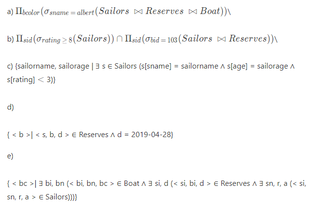
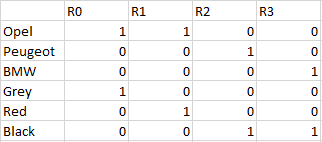
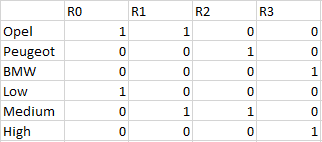
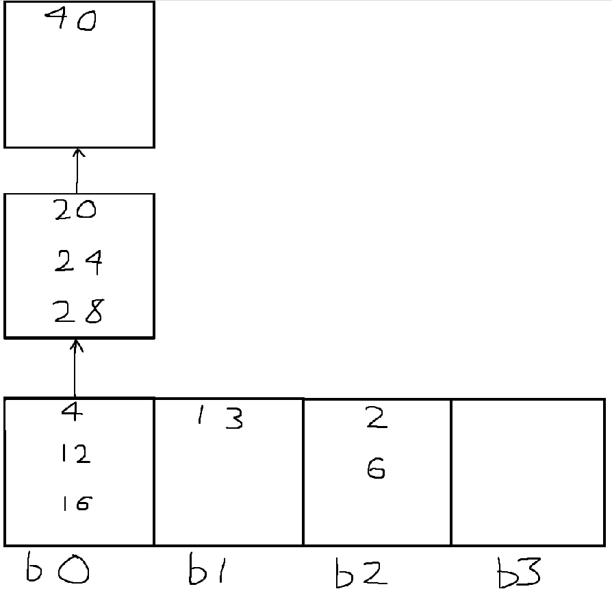

Ahmad Charba
300098891
CSI2532
Devoir 2

Q1: Normalization

a) 
- A, B
- D, B
- C, B

b) 
- C->D est non-trivial mais C n'est pas une super clé
- D->A est non-trivial mais D n'est pas une super clé

Une décomposition BCNF serait:\
R1 = (A, B, C)\
AB->C, AB est la super clé\

R2 = (C, D)\
C->D, C est la super clé\

R3 = (D, A)\
D->A, D est la super clé

c)
Aucune des dépendances ne sont perdues avec cette décomposition BCNF.

Q2: Dépendances fonctionnelles

a) 
- NIN -> eName
- NIN, contractNo -> hoursPerWeek
- hotelNo -> hotelLocation
- contractNo -> hotelNo

b)
- NIN, contractNo

c)\
Une décomposition 3NF serait:\
R1 = (NIN, eName), \
NIN -> eName

R2 = (NIN, contractNo, hoursPerWeek),\
NIN, contractNo -> hoursPerWeek

R3 = (hotelNo, hotelLocalisation),\
hotelNo -> hotelLocation

R4 = (contractNo, hotelNo),\
contractNo -> hotelNo

Q3: Langues pures

a)
$\Pi_{bcolor}(\sigma_{sname\ =\ albert}(Sailors\ \bowtie Reserves\ \bowtie Boat))$\

b) 
$\Pi_{sid}(\sigma_{rating\ \geq\ 8}(Sailors))\cap\Pi_{sid}(\sigma_{bid\ =\ 103}(Sailors\ \bowtie Reserves))$\

c) 
<p1>
{sailorname, sailorage | ∃ s ∈ Sailors (s[sname] = sailorname ∧ s[age] = sailorage ∧ s[rating] $\lt$ 3)}
</p1>

d)

<p1>
{ &#60 b &#62| &#60 s, b, d &#62 ∈ Reserves ∧ d = 2019-04-28}
</p1>

e)
<p1>
{ &#60 bc &#62| ∃ bi, bn (&#60 bi, bn, bc &#62 ∈ Boat ∧ ∃ si, d (&#60 si, bi, d &#62 ∈ Reserves ∧ ∃ sn, r, a (&#60 si, sn, r, a &#62 ∈ Sailors)))}
</p1>

Q4: RAID

- 1 B
- 2 D
- 3 C
- 4 A
- 5 E

Q5: 

n = 4 donc: 
- Les noeuds internes ont entre 2 et 4 enfants
- Les feuilles ont entre 2 et 3 valeurs
- La racine a au moins 2 enfants ou est une feuille à 0 à 3 enfants

a) 

Q6: Index Bitmap\
a)

b)\
i) 
SELECT Brand UNIQUE WHERE 
NOT Black bitmap\
donc, NOT 0011 = 1100\
R0 --> Opel\
R1 --> Opel\
Au final, on a Opel

ii)\
\
SELECT count(*) WHERE \
Medium bitmap AND Opel bitmap\
Donc, 0110 AND 1100 = 0100 \
Il y a 1 model qui répond aux conditions

Q7: Hashing

a)

b) 
Non, car les données ne sont pas bien réparties selon cet ensemble de clés. 2 overflow buckets sont nécéssaires pour le bucket 0, alors que le bucket 3 est complètement vide.

